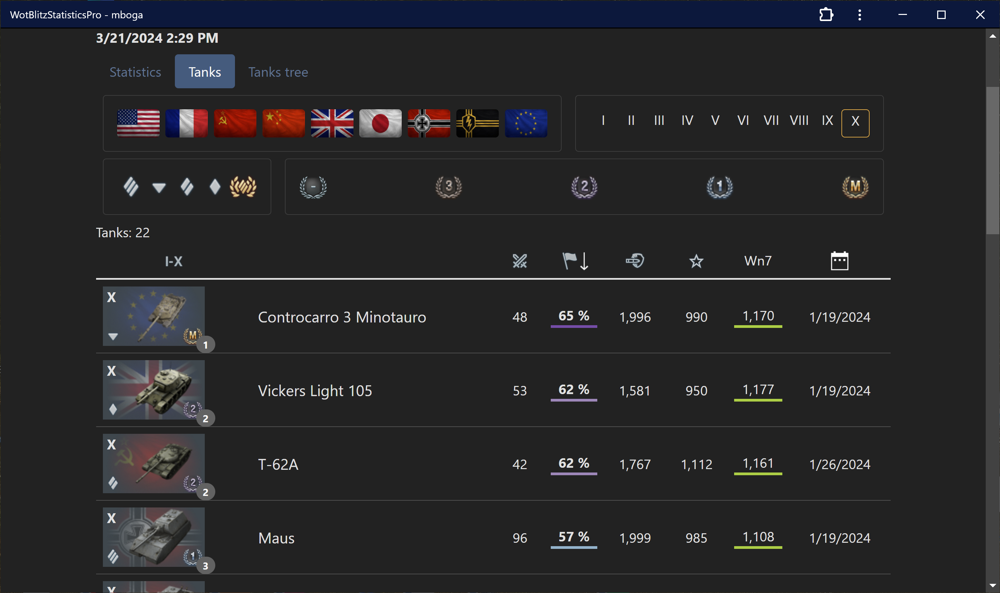
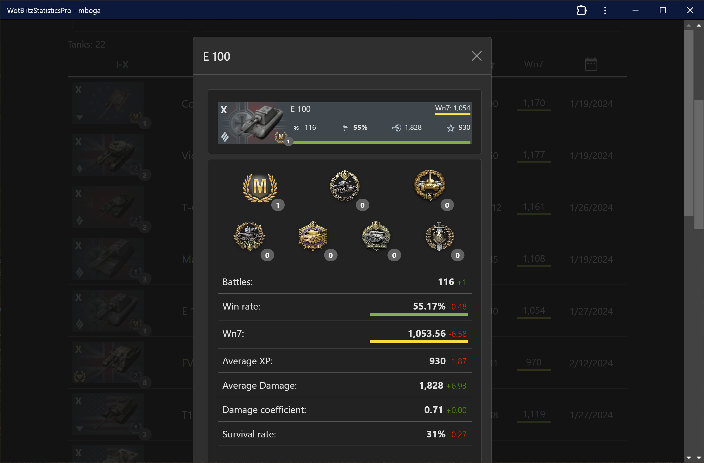
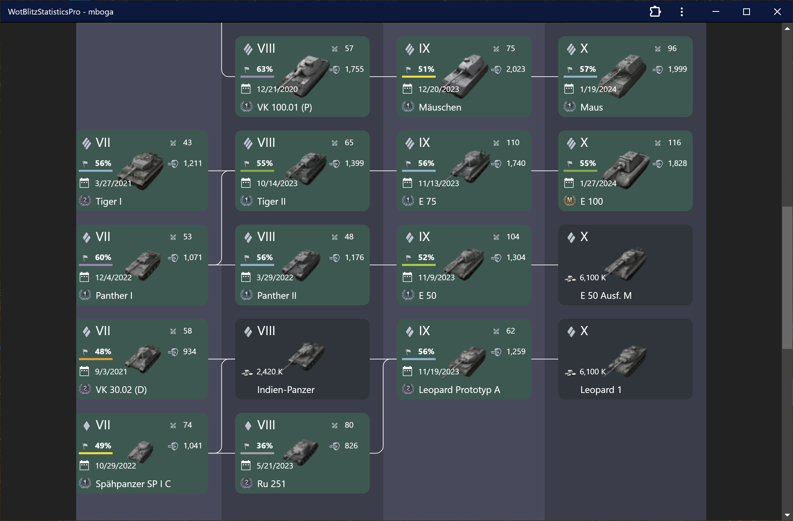

# WotBlitzStatisticsPro

Detailed player &amp; tank statistics and history for [World of Tanks: Blitz](https://wotblitz.com/)





- A Blazor WebAssembly application
- Uses [Wargaming API Service](https://developers.wargaming.net/documentation/guide/getting-started/) for gathering players statistics
- Stores statistics snapshots in local database
- Allows to view players, their tanks and achievements statistics, and how it was change in time

This project uses [SqliteWasmHelper](https://github.com/JeremyLikness/SqliteWasmHelper) by Jeremy Likness. But not as a nuget package. I have cloned the original library and bumped it up to .net 7 manually, because on 05.01.2023 the [pull request](https://github.com/JeremyLikness/SqliteWasmHelper/pull/7) still not merged.

## Run as docker container

```bash
docker build -t wotblitzstatisticspro .
docker run -dp 8840:80 --env WG_APP_ID=AppIdFromEnv wotblitzstatisticspro
```

## SQLite check

Run the application and use F12 to open developer tools.

1.  Check db name: Open the Application tab, Cache/CacheStorage/SqliteWasmHelper

2.  Navigate to the Console tab.:

```js
const cache = await caches.open('SqliteWasmHelper');
const resp = await cache.match('/data/cache/wotblitzstatisticspro.sqlite3'); // Path from step 1
const blob = await resp.blob();
URL.createObjectURL(blob);
```

## Update static tanks info

1. Get cached database and open it with [sqlitestudio](https://sqlitestudio.pl/)
2. Run query

```sql
SELECT s.TankId, MAX(s.LastBattleTime) LastBattleTime, MAX(s.Battles) Battles, MAX(s.WinRate) WinRate
FROM PlayerTankSessions s
    LEFT JOIN VehiclesDictionary v ON s.TankId = v.TankId
WHERE v.TankID is NULL
GROUP BY s.TankId
ORDER BY MAX(s.LastBattleTime) DESC
--
SELECT DISTINCT Type
FROM VehiclesDictionary
--
SELECT DISTINCT Nation
FROM VehiclesDictionary
```

3. Find info about each tankId and add it to the `wwwroot/missed-tanks.json`
